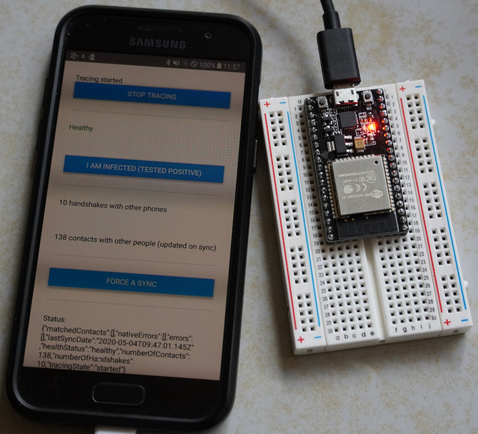

# esp32-dp3t

DP3T Advertising on ESP-32.

Ideal for every App developer having no second phone to test receiving dp3t beacons.

Current development: Only sends dp3t beacon.

## Hardware

Tested on [ESP-WROOM-32](https://www.espressif.com/en/products/modules/esp-wroom-32/overview)



## Quickstart

(1) Clone the repo:

```bash
git clone https://github.com/chriamue/esp32-dp3t.git
```

(2) Install Arduino IDE:

```bash
sudo apt install arduino
```

(3) Open Arduino IDE and install [arduino-esp32](https://github.com/espressif/arduino-esp32/blob/master/docs/arduino-ide/boards_manager.md)

(4) Open esp32-dp3t.ino file in Arduino IDE.

(5) Connect ESP-32 via USB. Select the USB-Port in the Arduino IDE. Build and Burn to ESP-32.

### Optional

Install the DP3T App to test receiving handshakes sended by the ESP-32.

Install nrf Connect to debug sended Beacons.

## Sources

ESP32 implementation of [https://github.com/dyne/decode-proximity-hw](https://github.com/dyne/decode-proximity-hw)

[The DP3T-SDK for Android](https://github.com/DP-3T/dp3t-sdk-android)

[React Native bindings for DP3T SDK (iOS + Andoid)](https://github.com/fmauquie/react-native-dp3t-sdk)
